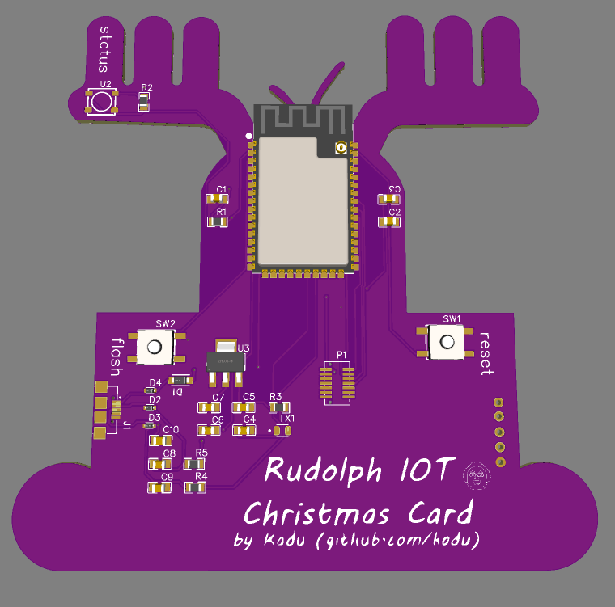

# Rudolph the red noused IOT Christmas Card

## Welcome aboard

Hi, I'm a Rudolph and you know me from Santa's Stories, and I'm here to help him to bring messages from all around the world directly to your Christmas tree.

Nowadays with some travel restrictions, Santa's asked me some genial Ideas to make happier people, and looking at my desk I found some DIY materials and with some effort, I've created my first IoT device (I'm fancy). Let me show "my precious":

I've got an Espressif MCU module called ESP32-S2 and an Oled display (SSD1309) with 2.4" and 128x64 pixels, some headers, and a cool PCB (did you like?)  that works with a Firmware that can connect to the Internet and receive messages from a Twitter account and show on the screen.

First, you will need to configure Internet Connection, and after you will be guided to get your Twitter API credentials and spread two the world how all the universe can send a graceful message directly to your Christmas tree.

All this hard work make me tired, and you know, in a few months I need to help Santa again, the Firmware code is an Open Source art of code, and you are invited to help Santa too, come with us spread happiness around the world

## JULIALABS PCB CHALLENGE 2021

In the last year (2020) I've participated in the 2020 version of this challenge with the [Angel project](https://www.pcbway.com/project/shareproject/Christmas_PCB_Contest___JuliaLabs.html) and this year (2021) I'm in the contest again with Rudolph, wish me luck!

Thanks, [Julia](https://www.twitch.tv/julialabs) to promote this so-cool contest, thanks also [Mouser](https://br.mouser.com/) and [PCBWay](https://www.pcbway.com/) to be together with Julia in this journey, and [Altium Designer](https://www.altium.com/altium-designer/). THANKS

## Relevant Links!

Before seeing the next part of the project documentation, let me share some links. If you want to reproduce this PCB with PCBWay, just [click here](https://www.pcbway.com/project/shareproject/Rudolph_the_Red_Christmas_IOT_Card_fdf2904b.html).

And here is the Bill of Materials in Mouser Project Page [click here to see](https://www.mouser.com/ProjectManager/ProjectDetail.aspx?AccessID=f3c79484f0).

The OLED display is pushed in Ali Express, [click here to see](https://s.click.aliexpress.com/e/_Aa7ykQ)

## Hardware

I've decided to use an ESP32-S2 standalone configuration for this project, It means that Kadu (the guy that help me to turn this thru the real world) found a project called [Franzininho Wifi](https://github.com/Franzininho/Franzininho-WIFI) that use the same ESP32-S2 MCU and got a lot of Fabio's (Franzininho creator) idea and uses in mine. You could check the list of components that I've used in this CSV or directly on the Mouser Project Page.

## Software

This is a work in progress and will be made using Arduino Framework (if possible in the Platform.io environment). The Idea is to have a Wifi configuration that users can put their credentials and guided steps to configure Twitter, and after that, messages could be shown in the Screen

## Images

## Schematics

## Bill of materials

| Qtde| Item              | Descrição       |
| --- | ---               | ---             |
| 01  | [ESP32-S2-WROOM](https://br.mouser.com/ProductDetail/356-ESP32S2WRM3200PH)    | MCU ESP32-S2    |
| 02  | [667-EVQ-P0N02B](https://br.mouser.com/ProductDetail/667-EVQ-P0N02B)    | Push Button     |
| 02  | [WSL080500000ZEA9](https://br.mouser.com/ProductDetail/71-WSL080500000ZEA9)  | Resistor 0Ohms  |
| 04  | [TMCP1A106MTRF](https://br.mouser.com/ProductDetail/74-TMCP1A106MTRF)     | Capacitor 10uF  |
| 03  | [885382207007](https://br.mouser.com/ProductDetail/710-885382207007)      | Capacitor 100nF |
| 02  | [C0805C200J3GACTU](https://br.mouser.com/ProductDetail/80-C0805C200J3G)  | Capacitor 20pF  |
| 01  | [C0805C105K4RAC7210](https://br.mouser.com/ProductDetail/80-C0805C105K4R7210)| Capacitor 1uF   |
| 01  | [1N5819W-T](https://br.mouser.com/ProductDetail/583-1N5819W-T)         | Diode           |
| 03  | [CPDUC5V0R-HF](https://br.mouser.com/ProductDetail/750-CPDUC5V0R-HF)      | Diode           |
| 01  | [APT2012CGCK](https://br.mouser.com/ProductDetail/604-APT2012CGCK)       | LED             |
| 01  | [4684](https://br.mouser.com/ProductDetail/485-4684)              | Neopixel RGB LED|
| 01  | [NCP1117LPST33T3G](https://br.mouser.com/ProductDetail/863-NCP1117LPST33T3G)  | LDO             |
| 01  | [20021121-00010C8LF](https://br.mouser.com/ProductDetail/649-200211210010C8LF)| Headers         |
| 01  | [UJ2-MIBH-G-SMT-TR](https://br.mouser.com/ProductDetail/490-UJ2-MIBH-G-SMTTR) | USB Socket      |
| 01  | [OLED Display](https://s.click.aliexpress.com/e/_Aa7ykQ)      | OLED Display    |
